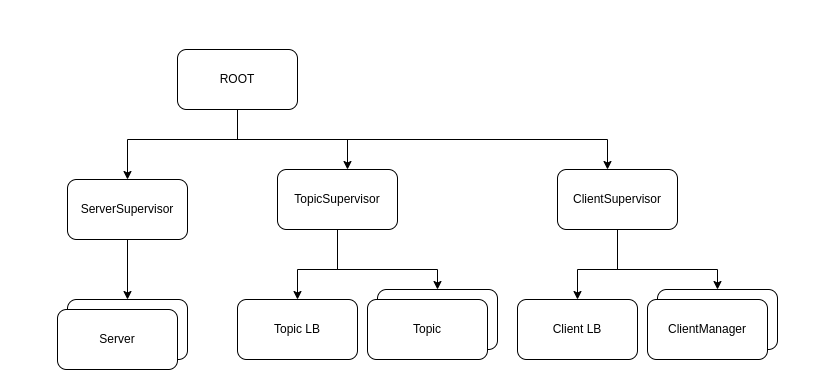
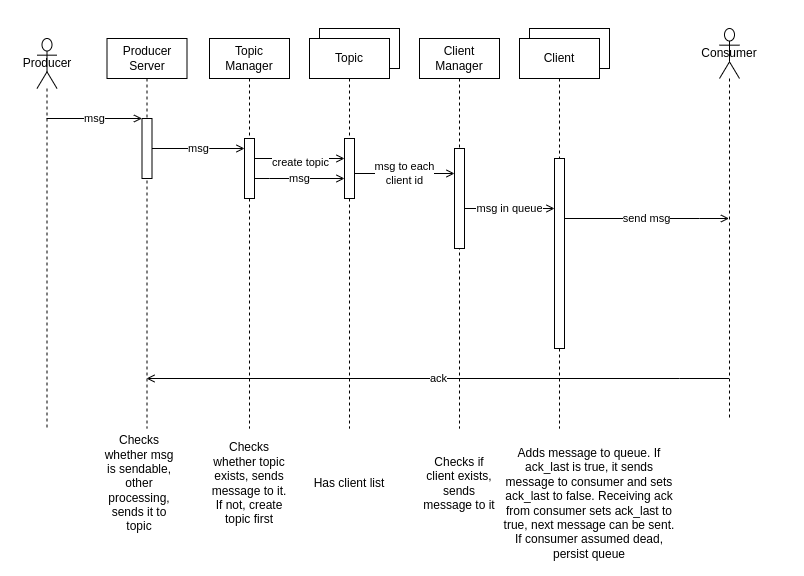
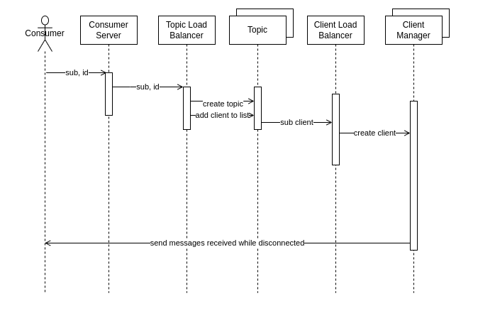

# FAF.PTR16.1 -- Project 2
> **Performed by:** Magal Vlada, group FAF-203
> **Verified by:** asist. univ. Alexandru Osadcenco

## Diagrams





## Minimal Tasks

*  The message broker provides the ability to subscribe to publishers (if you are a consumer)
and publish messages for subscribed consumers to receive (if you are a publisher);

Clients send a mesage of this form to subscribe:

```json
{"event": "sub", "topics": ["moon", "pills"], "data": 0}
```

The Topic Manager first checks if the message if a"subs" message and then it requests a new id form the Client Manager.

```elixir
defp decode(msg, from) do
    decoded = Jason.decode(msg)

    case decoded do
      {:ok, %{"event" => "sub", "data" => id, "topics" => topics}} ->
        new_id = Client.Manager.handle_sub(id, from)
        %{"event" => "sub", "data" => new_id, "topics" => topics}

      {:ok, %{"event" => "ack", "data" => [id, msg], "topics" => _topics}} ->
        Client.Manager.dispatch(id, {"ack", msg})
        %{"event" => "ack", "data" => {id, msg}, "topics" => []}

      {:ok, m = %{"event" => _, "data" => _data, "topics" => _topics}} ->
        m

      unsendable ->
        Topic.DeadLtrChannel.handle_unsendable(unsendable)
        %{"event" => "unsendable_msg", "data" => unsendable, "topics" => []}
    end
  end
```

Then each topic handles the subscribe by adding the client's id to its own list.
```elixir
  def handle_cast({:handle, msg}, state) do
    new_clients =
      case msg do
        {"sub", id} ->
          if id in state[:clients] do
            state[:clients]
          else
            [id | state[:clients]]
          end

        {"unsub", id} ->
          string_id = id |> to_string() |> String.to_atom()
          state[:clients] -- [string_id]

        {"msg", data} ->
          for client <- state[:clients],
              do: Client.Manager.dispatch(client, data)

          state[:clients]

        {"unsendable", _data} ->
          nil
          state[:clients]
      end

    Logger.debug("TOPIC old #{state[:name]} #{inspect(state[:clients])}")
    Logger.debug("TOPIC #{state[:name]} #{inspect(new_clients)}")

    {:noreply, %{state | clients: new_clients}}
  end
```

* The message broker represents a dedicated TCP / UDP server;

The clients and producers connect to the Server.

```elixir
defmodule Server do
  require Logger

  def init({ip, port}) do
    Process.flag(:trap_exit, true)

    pid =
      spawn_link(fn ->
        {:ok, listen_socket} =
          :gen_tcp.listen(port, [:binary, {:packet, :line}, {:active, true}, {:ip, ip}])

        Logger.info("TCP Server #{inspect(self())} accepting connections on port #{port} IP#{inspect(ip)}")

        accept(listen_socket, {ip, port})
      end)

    {:ok, pid}
  end

  defp accept(listen_socket, {ip, port}) do
    case :gen_tcp.accept(listen_socket) do
      {:ok, client} ->
        pid =
          spawn_link(fn ->
            Logger.info("Connection accepted on P#{port} : #{inspect(client)}")

            loop({ip, port})
          end)

        # set the controlling process of the client socket to the spawn
        :gen_tcp.controlling_process(client, pid)
        accept(listen_socket, {ip, port})

      err ->
        Logger.error(err)
    end
  end

  defp loop({ip, port}) do
    receive do
      {:tcp, socket, packet} ->
        Topic.Manager.dispatch(packet, socket)
        loop({ip, port})

      {:tcp_closed, socket} ->
        Logger.info("CLOSED P#{port}: #{inspect(socket)}")

      {:tcp_error, socket, reason} ->
        Logger.info("Error P#{port} #{reason} #{inspect(socket)}")
    end
  end
end
```

* The message broker allows for clients to connect via telnet / netcat;

You can connect to the server by using telnet or netcat. Ex.:

```bash
netcat 127.0.0.1 6666
```

* The message broker provides the ability to subscribe to multiple topics (if you are a
consumer) and publish messages on different topics (if you are a publisher);

Clients can subscribe to multiple topics and producers can publish messages with multiples topics:

```json
{"event": "msg", "topics": ["moon", "cat"], "data": "a"}

{"event": "sub", "topics": ["pill", "wood"], "data": 1}
```

The Topic Manager handles the messages by dispatching the message to each topic in the topic list:

```elixir
  def handle_cast({:dispatch, msg_json, from}, list) do
    msg = decode(msg_json, from)

    # Logger.debug(inspect(list))

    new_topic_list =
      Enum.reduce(msg["topics"], list, fn string, acc ->
        topic = string |> String.downcase() |> String.to_atom()

        if topic in list do
          topic_pid = Topic.Supervisor.get_process(topic)
          Topic.handle(topic_pid, {msg["event"], msg["data"]})
          acc
        else
          new_topic_pid = Topic.Supervisor.add_topic(topic)
          Topic.handle(new_topic_pid, {msg["event"], msg["data"]})
          [topic | acc]
        end
      end)

    {:noreply, new_topic_list}
  end
```

* The project has an executable that can run the message broker with a single click /
command.

Start the Message Broker by calling:
```bash
mix run lib/script.exs
```

## Main Tasks

* The message broker provides the ability to unsubscribe to consumers;

Each topic handles the "unsub" message by removing the client id form their client list.
```elixir
  def handle_cast({:handle, msg}, state) do
    new_clients =
      case msg do
        {"sub", id} ->
          if id in state[:clients] do
            state[:clients]
          else
            [id | state[:clients]]
          end

        {"unsub", id} ->
          string_id = id |> to_string() |> String.to_atom()
          state[:clients] -- [string_id]

        {"msg", data} ->
          for client <- state[:clients],
              do: Client.Manager.dispatch(client, data)

          state[:clients]

        {"unsendable", _data} ->
          nil
          state[:clients]
      end

    Logger.debug("TOPIC old #{state[:name]} #{inspect(state[:clients])}")
    Logger.debug("TOPIC #{state[:name]} #{inspect(new_clients)}")

    {:noreply, %{state | clients: new_clients}}
  end
```

* The message broker has a dead letter channel for messages deemed “unsendable”;

The Dead Letter Channel just adds unsendable messages to its state.

```elixir
defmodule Topic.DeadLtrChannel do
  use GenServer
  require Logger

  def start_link() do
    GenServer.start_link(__MODULE__, [], name: __MODULE__)
  end

  def init(_) do
    Logger.info("Dead Letter Channel is up.")
    {:ok, []}
  end

  def handle_unsendable(msg) do
    GenServer.cast(__MODULE__, {:handle, msg})
  end

  def handle_cast({:handle, msg}, state) do
    new = [msg | state]
    Logger.info("Dead Letter Channel state: #{inspect(new)}")
    {:noreply, new}
  end
end

```

* The message broker allows for communication via structures / classes, serialized to be
sent via network;

The clients/producers communicate with the message broker by jsons of the form:

```json
{"event": "ack", "topics": [], "data": [1, "Your ID is 1"]}


{"event": "sub", "topics": ["cat"], "data": 0}

{"event": "msg", "topics": ["pill"], "data": "ab"}
```

The Topic Manager deserializes them and extracts all needed information:

```elixir
  defp decode(msg, from) do
    decoded = Jason.decode(msg)

    case decoded do
      {:ok, %{"event" => "sub", "data" => id, "topics" => topics}} ->
        new_id = Client.Manager.handle_sub(id, from)
        %{"event" => "sub", "data" => new_id, "topics" => topics}

      {:ok, %{"event" => "ack", "data" => [id, msg], "topics" => _topics}} ->
        Client.Manager.dispatch(id, {"ack", msg})
        %{"event" => "ack", "data" => {id, msg}, "topics" => []}

      {:ok, m = %{"event" => _, "data" => _data, "topics" => _topics}} ->
        m

      unsendable ->
        Topic.DeadLtrChannel.handle_unsendable(unsendable)
        %{"event" => "unsendable_msg", "data" => unsendable, "topics" => []}
    end
  end
```

* The message broker provides MQTT-style assured delivery;

The Message Broker has Level 1 QoS - at least once. That means that the MB keeps sending the client the message until the client sends an acknowledgment back.

Each Client has a `last_ack` flag that represents if the last message sent has been ackowledged by the consumer.

```elixir
  def handle_cast({:ack, msg_ack}, state) do
    [msg | tail] = state[:queue]
    string_id = state[:id] |> to_string() |> String.to_atom()

    if msg == msg_ack and !state[:last_ack] do
      Logger.debug("Client #{state[:id]}. Ack came for #{msg}. Queue: #{inspect(tail)}")
      :dets.insert(:clients, {string_id, tail})
      {:noreply, %{state | last_ack: true, retry_lim: 10, queue: tail}}
    else
      {:noreply, state}
    end
  end
```

* The message broker ensures reliable message delivery using Persistent Messages with
subscriber acknowledgments and Durable Queues;

Messages in the Client queue are persisted using `:dets`. If the message is acknowledged as received by the consumer, the queue in the database is updated. This way, the messages survive a broker crash.

Durable Queues ensures that while the consumer is disconnected, the messages coming to its queue are still saved and can be sent to the consumer once it reconnects.

To implement this, a few things were needed:

1. Client actors don't exit whenever a consumer disconnects; or, if some whatever reason they crash, they must be restarted and retrieve their persisted messages (as you can see in `init()`).
2. If the client has been assumed dead (`last_ack` is false and the `retry_lim` is 0 -- meaning the last message sent has not been marked as received and the Client actor tried to send it over 10 times), messages are still added to the Client queue.
3. The disconnected consumer must send a subscribe message with their **old** ID, then an ack message to receive the messages in the queue.

```elixir
defmodule Client do
  use GenServer
  require Logger

  def start_link({id, socket}) do
    GenServer.start_link(__MODULE__, {id, socket})
  end

  def init({id, socket}) do
    Logger.info("Client #{id} is up")
    :timer.send_after(5000, self(), :send)

    string_id = id |> to_string() |> String.to_atom()

    persisted =
      case :dets.lookup(:clients, string_id) do
        [{_, data}] -> data
        [] -> []
      end

    Logger.debug("Client #{id}'s persisted queue: #{inspect(persisted)}")
    {:ok, %{id: id, socket: socket, queue: persisted, last_ack: true, retry_lim: 10}}
  end

  def change_socket(pid, socket) do
    GenServer.cast(pid, {:socket, socket})
  end

  def handle_cast({:socket, socket}, state) do
    {:noreply, %{state | socket: socket, retry_lim: 10}}
  end

  def handle_msg(pid, msg) do
    case msg do
      {"ack", msg} ->
        GenServer.cast(pid, {:ack, msg})

      _ ->
        GenServer.cast(pid, {:handle, msg})
    end
  end

  def handle_cast({:ack, msg_ack}, state) do
    [msg | tail] = state[:queue]
    string_id = state[:id] |> to_string() |> String.to_atom()

    if msg == msg_ack and !state[:last_ack] do
      Logger.debug("Client #{state[:id]}. Ack came for #{msg}. Queue: #{inspect(tail)}")
      :dets.insert(:clients, {string_id, tail})
      {:noreply, %{state | last_ack: true, retry_lim: 10, queue: tail}}
    else
      {:noreply, state}
    end
  end

  def handle_cast({:handle, msg}, state) do
    queue = state[:queue] ++ [msg]
    string_id = state[:id] |> to_string() |> String.to_atom()
    :dets.insert(:clients, {string_id, queue})
    {:noreply, %{state | queue: queue}}
  end

  def handle_info(:send, state) do
    :timer.send_after(5000, self(), :send)

    if length(state[:queue]) > 0 do
      [msg | _tail] = state[:queue]

      Logger.debug(
        "Client #{state[:id]}. Msg: #{msg}. Queue: #{inspect(state[:queue])}. Last ack? #{state[:last_ack]}. Retry: #{state[:retry_lim]}."
      )

      cond do
        state[:last_ack] ->
          :gen_tcp.send(state[:socket], msg <> "\n")
          {:noreply, %{state | last_ack: false}}

        !state[:last_ack] and state[:retry_lim] > 0 ->
          :gen_tcp.send(state[:socket], msg <> "\n")
          cnt = state[:retry_lim] - 1
          {:noreply, %{state | retry_lim: cnt}}

        true ->
          Logger.debug("Client #{state[:id]} assumed dead.")
          {:noreply, state}
      end
    else
      {:noreply, state}
    end
  end
end
```

* The project provides a Docker container to run the message broker.


```dockerfile
FROM elixir:latest

WORKDIR /app

COPY . .

RUN mix local.hex --force

RUN mix deps.get 

CMD mix run /app/lib/script.exs
```

## Conclusion

While working on this project I've learned how to model a system based on requirements using diagrams and implement it. I've gained a comprehensive understanding about message brokers, their patterns, and different ways of implementing them.

Elixir's actor model has proven a perfect fit for creating a message broker; the lightweight and supervised actors allow for a fault-tolerant message broker. Message passing and pattern matching allow for the messages in the system to be processed easily and efficiently.

## Bibliography

* TCP Server https://medium.com/blackode/quick-easy-tcp-genserver-with-elixir-and-erlang-10189b25e221
* Task and gen_tcp https://elixir-lang.org/getting-started/mix-otp/task-and-gen-tcp.html
* gen_tcp:controlling_process https://stackoverflow.com/questions/11409656/erlang-avoiding-race-condition-with-gen-tcpcontrolling-process
* Elixir Docs, as usual https://elixir-lang.org/docs.html
* MQTT QoS Levels https://www.hivemq.com/blog/mqtt-essentials-part-6-mqtt-quality-of-service-levels/
* Queues https://www.rabbitmq.com/queues.html#durability